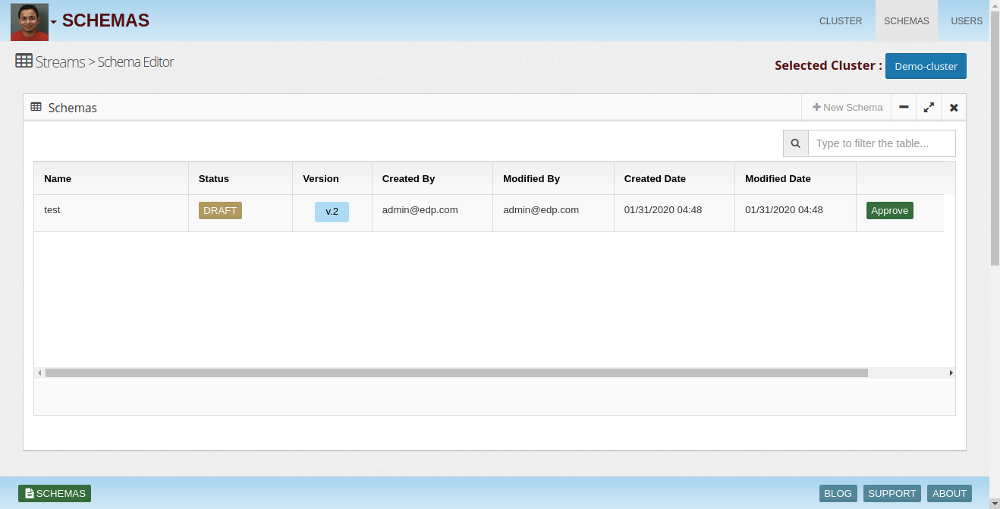
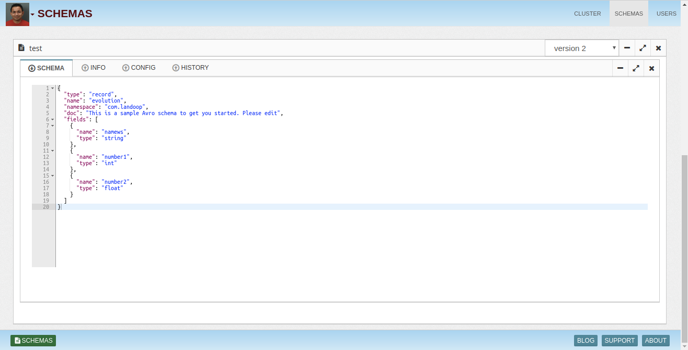
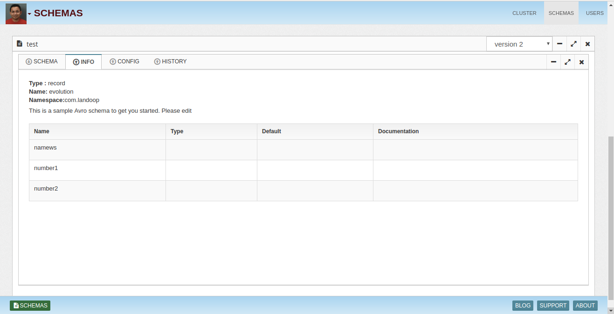
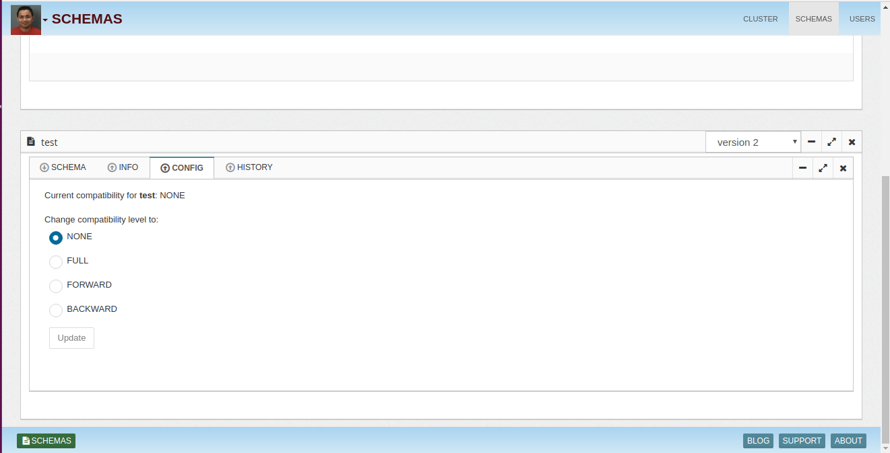
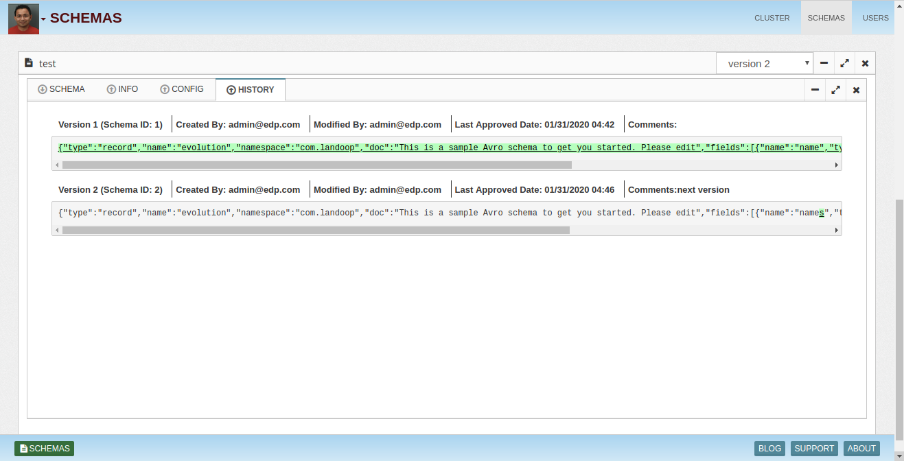
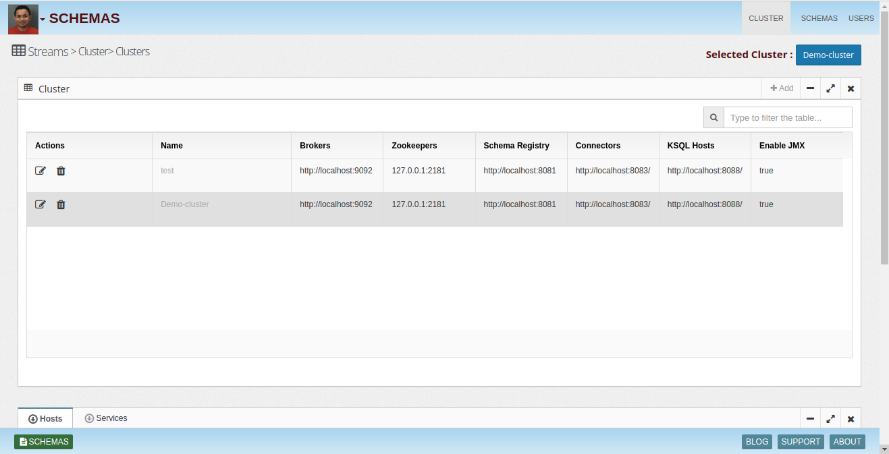
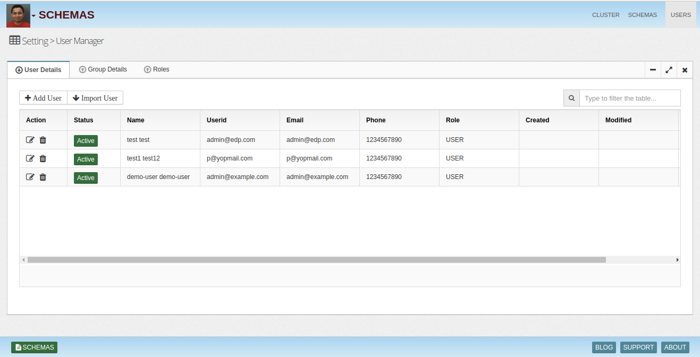
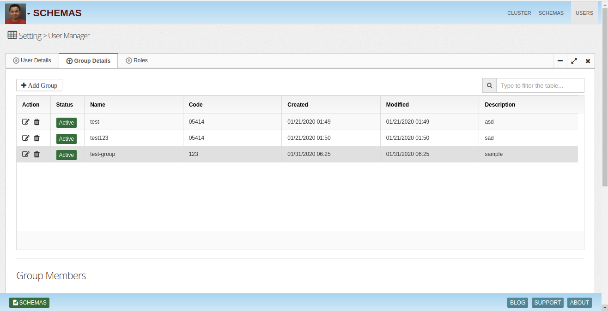

## Streams Schema UI

Streams Schema UI is a web tool to manage AVRO schemas in Kafka Schema Registry seamlessly. 

Schema management  - Enterprise wide schema management 
Create, update and maintain schema hierarchies Audit trail of schema changes Validate and test compatibility Schema designer Data catalog integration
Schema management allows admins to create and update schemas, maintain versions and compatibility. It tracks schema change audit logs. It also allows developers a read only view to adhere to approved schemas in the applications.
Topic management Topic Creation | Promotion Data owner, consumers & producers

* Schema

* Info

* Config

* History

Cluster
--------

Users
--------

* User Details

* Group Details

InsightLake Data Explorer solution is part of InsightLake Data Platform. It provides an intuitive UI and allows users to connect to various data sources and explore the data eaisly.

To learn more, check out [http://insightlake.com/dataexplorer.html](http://insightlake.com/dataexplorer.html)

Installation
------
* Download or clone the repository. 
* Run bin/insightlake command.
* Open browser with URL as http://localhost:8080/
* Change configuration in /conf folder to set different ports
* By default H2 database is used, you can change the database details in jdbc.properties file

Installation using docker 
------
* Download or clone the repository. 
* cd /docker
* Run `docker-compose -f docker-compose.yaml up --build`
* Open browser with URL as http://localhost:8080/
* While creating Cluster use below Schema Registry URL  

        * http://schema-registry:8081

## Demo Link
https://insightlake.s3.amazonaws.com/releases/schema/index.html

License - Free for commercial use
------
InsightLake Data Explorer is a commercial product but distributed to be used freely. Please contact contact@insightlake.com for details.

Getting Help
----------

You can get help easily :
Slack Channel - [Join InsightLake Slack Community](https://join.slack.com/t/insightlake/shared_invite/enQtNzQzMDE3MDI4ODA1LWM2YmI5MDUzODM5ZjQzZjE3ZDk1MjhiNThjMTBkODJjMGU2OWJmOWQ0MDE5NGI4YjYyYjVhZjEzYzY3YzIzMjY)

Twitter - https://twitter.com/InsightLake

Facebook - https://www.facebook.com/insightlake/

